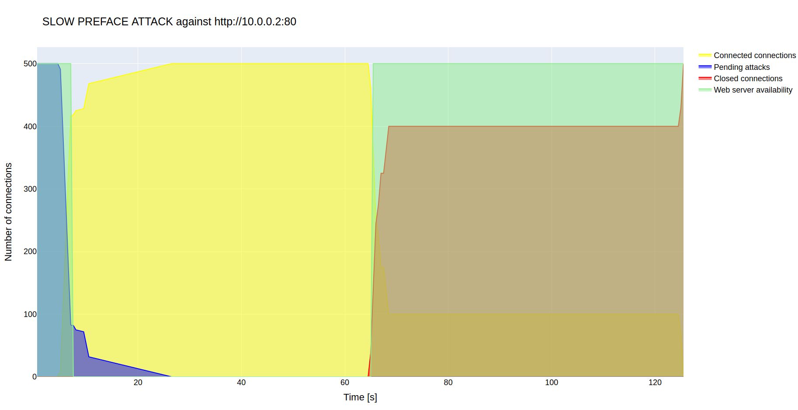

# SLOWHTTP2TEST
HTTP/2 Application Layer DoS Simulator

## Getting Started
* Download this repo
* Ensure to have created and activated virtual evnironment
```
python3 -m venv venv        # create virtual environment
source venv/bin/activate    # activate virtual environment
```
* Install necessary packages
```
pip install -r requirements.txt
```

Before running testing attacks, ensure availability of tested web server. 
```
ping 'ip address'
```
And ensure, that it accepts HTTP/2 connection,
```
curl --http2-prior-knowledge http://'ip address':'port'
```

## Attack Example
usage:
```
python3 slowhttp2test.py [-h] [-p port] [-o file] [-c connections] [-v] HOST ATTACK
```

```
positional arguments:
  HOST                  IP address of a victim
  ATTACK                Type of Slow DoS Attack
                        read      -- SLOW READ ATTACK
                        post      -- SLOW POST ATTACK
                        preface   -- SLOW PREFACE ATTACK
                        headers   -- SLOW HEADERS ATTACK
                        settings  -- SLOW SETTINGS ATTACK

optional arguments:
  -h, --help            show this help message and exit
  -p port, --port port  port of web application (80 default)
  -o file, --out file   name of output .csv and .html files
  -c connections, --connection connections
                        number of parallel connections to webserver (10 default)
  -v, --verbal          verbal output of attack - logged steps

```
### Example
Slow Preface Attack on target http://10.0.0.2:80 with 500 openned connection and output to 'test.csv' and 'test.html' and verbose logging
```
python3 slowhttp2test.py 10.0.0.2 preface -p 80 -o test -c 500 -v
```

Generated graph in file 'test.html':



## Author
* **Michael Jurek** - *Initial work, practical part of bachelor thesis*

## License

This project is licensed under the MIT License - see the [LICENSE](LICENSE) file for details
